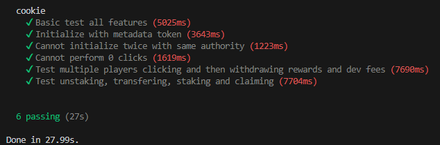

  

# Sol Cookie

Created by: Mr F, ToCsIcK and sol_dev

https://solcookie.fun/  
https://x.com/MrFwashere  
https://t.me/solcookiefun

## Game Mechanics

### Cookie Minting
- Mint `$COOKIE` tokens by clicking the Cookie
- Initial mint price: `0.0001 SOL` per `$COOKIE`
- Global price increase: `1 lamport` (`0.000000001 SOL`) per `$COOKIE` minted
- Max `1000` `$COOKIE` per transaction

### Auto-Staking
- `$COOKIE` tokens auto-staked on mint
- Mint revenue split: 90% to staked `$COOKIE` pool, 10% to devs

### Token Supply
- Initial supply: `3,000,000` `$COOKIE` on Raydium v3
- Supply increases with each mint

### Jackpot System
- `0.01%` chance per `$COOKIE` minted to win jackpot (max 10% for `1000` `$COOKIE`)
- Jackpot: `10,000` bonus `$COOKIE` tokens

 

## RNG Mechanism

Our program adapts the "future blockhash" concept sometimes used on Ethereum to Solana.

- Uses `slot_hashes` sysvar for entropy
- Stores player's last mint slot, commits to use next slothash
- `resolve` function determines win if called within 512 slots (~3.4 mins)
- UI displays win if detected (calculated locally)
- Allows manual resolution or auto-resolve on next click

See `resolve.rs` and `click.rs` for implementation details.

### Security Note:
Validators could potentially manipulate wins by brute-forcing block data.   
However, running a competitive validator requires ~80,000+ SOL ($10M USD).  
This requirement versus the potential reward, plus the difficulty of execution makes such an attack unlikely.

 

## Program Structure

### Standard Anchor

| File                    | Description                                    |
|-------------------------|------------------------------------------------|
| lib.rs                  | List of functions                              |
| mod.rs                  | List of modules                                |
| error.rs                | Errors                                         |
| state.rs                | State structure                                |

### Custom

| File                    | Description                                    |
|-------------------------|------------------------------------------------|
| click.rs                | Main game function, token minting              |
| helpers.rs              | Utility functions                              |
| initialize_with_token.rs| Game setup and create new Metaplex token       |
| initialize.rs           | Game setup for existing token                  |
| claim_rewards.rs        | Claim rewards from staking                     |
| withdraw.rs             | Withdraw fees                                  |
| resolve.rs              | Future slothash RNG resolution                 |
| stake .rs               | Stake cookies                                  |
| unstake.rs              | Unstake cookies                                |

 

## Running the Tests

1. Install Rust:  
   https://www.rust-lang.org/tools/install

2. Install Anchor:  
   https://www.anchor-lang.com/docs/installation

3. Build the project:  
   `anchor build`

4. Run the tests:  
   `anchor test`

You should see:

  

